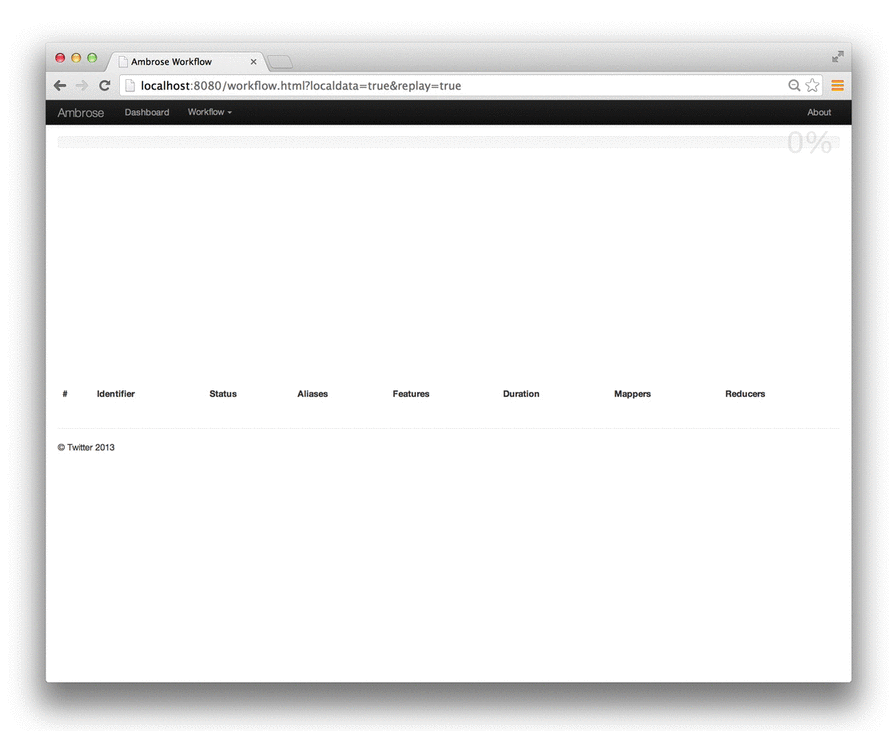

# Ambrose [](http://travis-ci.org/twitter/ambrose)

Twitter Ambrose is a platform for visualization and real-time monitoring of MapReduce data workflows.
It presents a global view of all the map-reduce jobs derived from your workflow after planning and
optimization. As jobs are submitted for execution on your Hadoop cluster, Ambrose updates its
visualization to reflect the latest job status.

Ambrose provides the following in a web UI:

* A workflow progress bar depicting percent completion of the entire workflow
* A table view of all workflow jobs, along with their current state
* A graph diagram which depicts job dependencies and metrics
    * Visual weighting of jobs based on resource consumption
    * Visual weighting of job dependencies based on data volume
* Script view with line highlighting (Pig only)

Ambrose is built using the following front-end technologies:

* [jQuery](http://jquery.com), [UnderscoreJS](http://underscorejs.com), [RequireJS](http://requirejs.org) - Core javascript libraries and JS module definition
* [D3.js](http://d3js.org) - Diagram generation
* [Bootstrap](http://getbootstrap.com/) - Layout and CSS support

Ambrose is designed to support any workflow runtime. See the following section for supported
runtimes.

Follow [@Ambrose](https://twitter.com/ambrose) on Twitter to stay in touch!

## Supported runtimes

* [Pig](http://pig.apache.org/) - See [pig/README.md](https://github.com/twitter/ambrose/blob/master/pig/README.md)
* [Hive](http://hive.apache.org/) - See [hive/README.md](https://github.com/twitter/ambrose/blob/master/hive/README.md)
* [Cascading](http://www.cascading.org/) - See [cascading/README.md](https://github.com/twitter/ambrose/blob/master/cascading/README.md)
* [Scalding](https://github.com/twitter/scalding) - See [scalding/README.md](https://github.com/twitter/ambrose/blob/master/scalding/README.md)
* [Cascalog](https://github.com/nathanmarz/cascalog) - future work

## Examples

Below is a screenshot of the Ambrose workflow UI. The interface presents multiple responsive "views"
of a single workflow. Just beneath the toolbar at the top of the window is a workflow progress bar
that tracks overall completion of the workflow. Below the progress bar is a graph diagrams which
depicts the workflow's jobs and their dependencies. Below the graph diagram is a table of workflow
jobs.

All views react to mouseover and click events on a job, regardless of the view on which the event is
triggered; Moving your mouse over the first row of the table will highlight that job's table row
along with the job's node in the graph diagram. Clicking on a job in any view will select it,
updating the highlighting of that job in all views. Clicking again on the same job will deselect it.



## Quickstart

To get started with Ambrose, first clone the Ambrose Github repository:

```
git clone https://github.com/twitter/ambrose.git
cd ambrose
```

Next, you can try running the Ambrose demo on your local machine. The demo starts a local web server
which serves the front-end client resources and sample data. Start the demo with the following
command and then browse to
[http://localhost:8080/workflow.html?localdata=large](http://localhost:8080/workflow.html?localdata=large):

```
./bin/ambrose-demo
```

To run Ambrose with a Pig script, you'll need to build the Ambrose Pig distribution:

```
mvn package
```

You can then run the following commands to execute `script.pig` with an embedded web server which
hosts the Ambrose web application:

```
cd pig/target/ambrose-pig-$VERSION-bin/ambrose-pig-$VERSION
AMBROSE_PORT=8080 ./bin/pig-ambrose -f script.pig
```

Note that the `pig-ambrose` script calls the `pig` script present in your local installation of Pig,
so make sure `$PIG_HOME/bin` is in your path. Now, browse to
[http://localhost:8080/web/workflow.html](http://localhost:8080/workflow.html) to see the progress
of your script with the Ambrose workflow UI.

## Maven repository

Ambrose releases can be found in the Maven Central Repository within package
[com.twitter.ambrose](http://central.maven.org/maven2/com/twitter/ambrose).

## How to contribute

Bug fixes, features, and documentation improvements are welcome! Please fork the project and send us
a pull request on Github. You can [submit issues on Github](https://github.com/twitter/ambrose/issues)
as well.

Here are some high-level goals we'd love to see contributions for:

* Improve the front-end client
* Add other visualization options
* Create a new back-end for a different runtime environment
* Create a standalone Ambrose server that's not embedded in the workflow client

## Versioning

For transparency and insight into our release cycle, releases will be numbered with the follow format:

`<major>.<minor>.<patch>`

And constructed with the following guidelines:

* Breaking backwards compatibility bumps the major
* New additions without breaking backwards compatibility bumps the minor
* Bug fixes and misc changes bump the patch

For more information on semantic versioning, please visit http://semver.org/.

## Authors

* [Bill Graham](https://github.com/billonahill) ([@billgraham](https://twitter.com/billgraham))
* [Andy Schlaikjer](https://github.com/sagemintblue) ([@sagemintblue](https://twitter.com/sagemintblue))
* [Gary Helmling](https://github.com/ghelmling) ([@gario](https://twitter.com/gario))
* [Nicolas Belmonte](https://github.com/philogb) ([@philogb](https://twitter.com/philogb))
* [Grace Zhang](https://github.com/gzhangT) ([@pkq1123](https://twitter.com/pkq1123))

## License

Copyright 2013 Twitter, Inc.

Licensed under the Apache License, Version 2.0: http://www.apache.org/licenses/LICENSE-2.0
